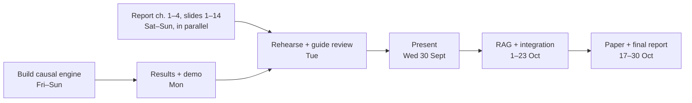

# Master Plan and Timeline

**For:** everyone · **Presentation:** Major Project Progress Presentation-II, Wednesday 30 September 2026 (time to be confirmed)

## The project in one paragraph

When metformin alone is not controlling an adult's type 2 diabetes, the doctor must add a second drug. DiaCausal compares the three common choices — an SGLT2 inhibitor, a DPP-4 inhibitor and a sulfonylurea — for that one patient. It first removes any option that is unsafe for them, then estimates each remaining option's six-month HbA1c change with a 95% range, and says "insufficient evidence" when the data is too thin to answer fairly. Explanations with citations (RAG) come next, in October. The doctor always decides.

## What the mentor asked for on 30 September

| # | Mentor's item | Where it comes from | Ready by |
|---|---|---|---|
| 1 | Proposed System | Report Chapter 3; slides 4–6 | Sat 26 |
| 2 | Hardware & Software Requirements | Report Chapter 4; slides 7–8 | Sat 26 |
| 3 | Timeline / Gantt Chart | Report Appendix A; slide 9 | Sat 26 |
| 4 | System Design | Report Chapter 4; slides 10–13 | Sun 27 |
| 5 | Implementation – 25% (we aim higher) | The GitHub repo, built with Claude Code | Sun 27 |
| 6 | Initial Results / Demo | Benchmark results + live demo | Mon 28 |

The mentor also wrote: *"Students must clearly demonstrate the work completed so far and explain the planned work for the remaining project."* That is slide 19 and the last section of Chapter 5.

## Why we don't make everything at the same time

Build first, then write the parts that need results. Items 1–4 do not depend on results, so teammates write them now while the engine is being built. Items 5 and 6 need the engine. The research paper waits until the full results are frozen in mid-October — a paper without final results would have to be rewritten.

## Who does what this week (suggested — change it if you like)

| Person | Main job this week | Also |
|---|---|---|
| Rhian | Builds the causal engine in a Claude Code cloud session; runs the demo | Presents the implementation slides |
| Pratham | Report in Overleaf (chapters 1–4 now, chapter 5 on Monday) | Leads the research paper in October |
| Graceton | Slides in Claude Design; system design diagrams | Presents the design slides and the demo |
| Advik | Gantt chart, hardware/software table, viva drills, messages to the guide | Keeps the backup kit |

## Day by day

### Friday 25 September (tonight)

- [ ] Rhian: claim the $100 cloud credit, connect GitHub, start a cloud session on DiaCausal-CDSS and paste Prompt 1 from document 02.
- [ ] Rhian: upload the Markdown copies of documents 02 and 04 into the repo's `docs/` folder so Claude Code can read them.
- [ ] Everyone: 20-minute call — agree the roles in the Master plan and open the DiaCausal Hub link.
- [ ] Pratham: upload the Overleaf zip (document 05) and check that it compiles.
- [ ] Advik: send the guide the message from the Master plan ("Message to the guide").

### Saturday 26 September

- [ ] Rhian: read Claude Code's inventory and plan, then reply "go". It builds steps a–f (data generator to metrics).
- [ ] Rhian: after each step, read its three-line explanation; ask "explain simpler" whenever something is unclear.
- [ ] Pratham: polish report chapters 1–4.
- [ ] Graceton: slides 1–14 with the Claude Design prompt in document 04.
- [ ] Advik: check the Gantt dates and the hardware/software table; start reading document 06.

### Sunday 27 September

- [ ] Rhian: Claude Code finishes steps g–j (benchmark, demo, API, tests) and opens a pull request. Merge it.
- [ ] Rhian: run the demo on the MacBook (document 02, Part 5).
- [ ] Everyone: 30-minute viva drill — each person answers 10 questions from document 06 aloud.

### Monday 28 September

- [ ] Rhian: share the `results/` folder; record a 3-minute demo video; take the three demo screenshots.
- [ ] Graceton: put results and screenshots into slides 15–19.
- [ ] Pratham: upload the results and code files to Overleaf — chapter 5 fills in automatically.
- [ ] Advik: backup kit — slides PDF, demo video and report PDF on a USB stick and in Google Drive.

### Tuesday 29 September

- [ ] 10 AM: rehearsal 1, timed, with the live demo.
- [ ] Show the guide the slides, demo and report; write down every comment.
- [ ] Fix, then rehearsal 2 in the evening. Freeze everything at 9 PM.

### Wednesday 30 September

- [ ] Arrive early. Open the demo before your slot (it takes about a minute to warm up).
- [ ] Keep the demo video and the slides PDF ready in case of Wi-Fi or laptop problems.

## After the mid-sem (to 30 October)

| Dates | Work |
|---|---|
| 1–9 Oct | RAG: choose licence-cleared sources and build retrieval; small engine fixes |
| 10–16 Oct | RAG answers with citations; results frozen; the doctor reviews 20–60 cases |
| 17–23 Oct | Connect RAG, engine and UI; full evaluation; paper draft |
| 24–30 Oct | Final report, paper, viva preparation |
| 31 Oct – 7 Nov | Practical exams — no project work |
| 18 – 30 Nov | Theory exams — no project work |
| December | Final submission; paper submission |

If Claude Pro ends around 6 October, do the heavy RAG building between 1 and 6 October (see document 08).

## Message to the guide (copy and send)

> Respected Dr. More, Group 28 here. For the Progress Presentation-II on 30 September we will show the proposed system, hardware and software requirements, the timeline, the system design, the causal-inference engine with initial results, and a live demo. Could you please confirm whether the project report is also required on 30 September? We would also like to show you our progress on Tuesday 29 September at a time convenient to you. — Rhian Roy Kuttikadan, for Group 28

## Risks and what we do about them

| Risk | What we do |
|---|---|
| Demo fails or Wi-Fi is down | Play the recorded video; show screenshots |
| Claude usage runs out | Build on the cloud credit; use "Reset for free" only when a limit is actually hit |
| Build not finished by Sunday | Show the modules that work; present the rest honestly as planned |
| A viva question you can't answer | "We haven't tested that yet — this is how we would." Never guess a number |
