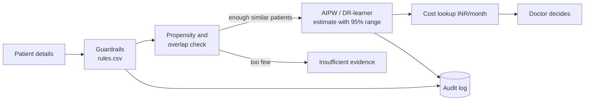

# Causal Engine Build Guide

**For:** Rhian (builds it) · everyone (read Part 1 before the viva)

## Part 1 — What we are building, in plain English

Picture a doctor with one patient and three possible add-on drugs. In old records, doctors gave different drugs to different kinds of patients, so simply comparing "who did better on which drug" is unfair. Our engine makes that comparison fair, for this one patient, and says honestly how sure it is.

**The worked example to remember (made-up numbers, HbA1c change in %):**

| Group of patients | Got SGLT2i | Got sulfonylurea | Difference |
|---|---|---|---|
| High starting HbA1c | 300 patients, −1.2 | 100 patients, −1.0 | −0.2 |
| Lower starting HbA1c | 100 patients, −0.6 | 300 patients, −0.5 | −0.1 |
| Everyone pooled (naive) | −1.05 | −0.625 | **−0.425** |

Comparing like with like and weighting both groups equally gives 0.5 × (−0.2) + 0.5 × (−0.1) = **−0.15**. The naive answer is about three times too big, only because sicker patients got SGLT2i more often. This is called **confounding by indication**, and correcting it is the whole point of causal inference.

### The engine in ten parts

| Step | Part | What it does | Why the panel cares |
|---|---|---|---|
| a | Synthetic cohort | Makes about 5,000 realistic Indian patients where we know the true effect of every drug | Lets us check our answers against the truth |
| b | Guardrails | Removes unsafe drugs first, using cited drug-label rules | Safety before prediction |
| c | Propensity model | Estimates how likely a patient like this was to get each drug | Measures the unfairness we must correct |
| c | Overlap check | If fewer than 5% of similar patients got a drug, says "insufficient evidence" | Refuses to guess |
| d | Naive, IPW, AIPW | The average effect three ways: unfair, re-weighted, doubly robust | Shows the correction works |
| e | DR-learner | The effect for this particular patient, with a 95% range | The personalised answer |
| f | Metrics | Compares estimates with the known truth | Proves accuracy |
| g | Benchmark | Runs everything 20 times; saves tables and figures | Initial results for mentor item 6 |
| h | Demo app | Enter a patient, see the options | The live demo |
| i–j | API and tests | A FastAPI endpoint; automated pytest checks | Engineering quality |



## Part 2 — Starting a Claude Code cloud session (uses the $100 credit)

1. Open your usage page and tap **Claim credit**, then **Continue**.
2. Connect GitHub and choose **Rhian-Roy/DiaCausal-CDSS**.
3. Before starting, add our notes to the repo so Claude Code can read them: on github.com open the repo → **Add file → Upload files** → upload `02_Causal_Engine_Build_Guide.md` into a folder named `docs` → **Commit changes**.
4. Start a cloud session. If there is a model menu, pick **Opus 5.5** for Prompt 1 (planning) and **Sonnet 5** for building.
5. Paste Prompt 1. You can close the laptop and come back later.
6. At the end you get a **pull request**: a proposed change you review on GitHub and merge with one button.

The credit only covers cloud sessions (not chats), expires on 5 November at 1:29 PM IST, and is for existing Pro and Max subscribers.

## Part 3 — The prompts, in order

### Prompt 1 — Inspect and plan (paste first)

```text
You're helping Group 28 (FCRIT Vashi) build DiaCausal, our final-year project: a decision-support prototype for adults with type 2 diabetes already on metformin. For one patient, it compares three second-line options (SGLT2 inhibitor, DPP-4 inhibitor, sulfonylurea) by estimating each option's 6-month HbA1c change with causal inference. Our mid-semester demo is on Wednesday 30 September 2026. I'm a beginner, so explain everything in plain English.

First read docs/02_Causal_Engine_Build_Guide.md if it exists. Part 6 has our reference tables; use them exactly.

Rules you must never break:
1. Decision support only; the clinician decides. Every screen and API response shows: "Research prototype for clinician evaluation; not a marketed medical device; not for unsupervised clinical use."
2. Safety rules run before any estimate. Contraindication and kidney-function thresholds live only in data/rules.csv with a source for each rule. Never hard-code or invent them. Never show drug doses.
3. Every estimate has a 95% interval. If an option's propensity for this patient is below 0.05, show "insufficient evidence" instead of a number.
4. Synthetic data only. Every generator parameter has a source and a status (CITED, ASSUMED-DIRECTIONAL or TEAM-SET) in params.yaml. The Pima dataset is not Indian data.
5. Units: HbA1c %, eGFR mL/min/1.73m2, cost INR/month. Asian-Indian BMI cut-offs (overweight >=23, obese >=25).
6. Never weaken or delete a test to make it pass. No API keys or secrets in this public repo.

Step 1 (inspect only; change nothing): read the whole repository and write
- docs/REPO_INVENTORY.md: the tech stack, each folder and what it does, what runs, what's broken, and what we can reuse;
- docs/CAUSAL_PLAN.md: a numbered plan for Step 2, which existing code to reuse, and how the demo will connect to the current UI.
Then summarise both in 10 plain sentences, tell me any files you need from me, and wait for me to say "go".

Step 2 (after "go"): build the causal engine in small steps. After each step, run the tests and explain what you did in 3 plain sentences.
a) Synthetic India-calibrated cohort: 3 options, confounding by indication, true potential outcomes stored.
b) Guardrails loaded from data/rules.csv, each with its citation.
c) Cross-fitted multinomial propensity model and overlap check.
d) Naive, IPW and AIPW average effects with 95% confidence intervals.
e) DR-learner patient-level effects with intervals.
f) Metrics against the true effects: bias, RMSE, interval coverage, PEHE, policy regret, covariate balance.
g) A benchmark script that saves results/results_table.tex, results/benchmark_summary.csv and the figures results/figures/overlap.png, love_plot.png, ate_vs_truth.png, cate_recovery.png and calibration.png.
h) A demo: a Streamlit app, or the existing UI if that's simpler (tell me which and why).
i) A FastAPI endpoint.
j) pytest tests for all of the above.

Step 3: add CLAUDE.md with the rules above, update the README with exact commands to run the tests, benchmark and demo on a MacBook, and open a pull request with a plain-English summary.
```

### Prompt 2 — Say "go" (after you have read its plan)

```text
go. Build Step 2 in the order a to j. After each step: run all tests, show me the test output, and explain in 3 plain sentences what you built and how I would explain it to an examiner. If a test fails, fix the code, not the test. Commit after each step with a clear message.
```

### Prompt 3 — When something is unclear (use as often as you like)

```text
Explain [the thing you don't understand] as if I'm a second-year student: one everyday analogy, one tiny numeric example, and the one-sentence answer I should give in a viva.
```

### Prompt 4 — When a test fails or something breaks

```text
The test [name] failed with this error: [paste it]. Find the cause, explain it in plain English, fix the code (not the test), rerun all tests and show me the output.
```

### Prompt 5 — Results for the presentation (Sunday)

```text
Run the benchmark (quick version first, then the full one). Then write docs/RESULTS_SUMMARY.md in plain English: which method is least biased, whether the 95% intervals contain the truth about 95% of the time, how the DR-learner compares with the simpler learners, the policy regret, how often the system abstains, and covariate balance before and after weighting. Use only numbers that are in the results files. List the five figures with one sentence each on how to read them. Commit results/ and the summary.
```

### Prompt 6 — Make the demo presentation-ready (Sunday)

```text
Make the demo presentation-ready: the intended-use statement at the top; three preset patients as buttons — (1) a typical patient, (2) eGFR 40 with a history of pancreatitis (shows an exclusion and cautions), (3) a patient likely to trigger "insufficient evidence"; a clear chart of each option's estimate with its 95% range; never use green for "recommended" (amber = caution, red = excluded, grey = insufficient evidence); an expandable "Why causal?" box with the worked example from docs/02_Causal_Engine_Build_Guide.md. Update the README with how to run it.
```

### Prompt 7 — Wrap up (Sunday night)

```text
Update CLAUDE.md and the README, make sure every test passes, and open a pull request titled "Causal engine v0.3 for mid-sem" with a plain-English summary, a checklist of what works, and a list of known limitations.
```

## Part 4 — How to know it's done

- [ ] `pytest` passes — paste the output into the team chat
- [ ] `results/` has `results_table.tex`, `benchmark_summary.csv` and five figures
- [ ] The demo shows an estimate with a 95% range, a red exclusion with its source, an amber caution, and a grey "insufficient evidence"
- [ ] Every screen and API response shows the intended-use statement
- [ ] No drug doses anywhere in the output
- [ ] The pull request is merged into `main`

## Part 5 — Running the demo on the MacBook

**Option A — on the laptop (always keep this as the backup).** Install Python 3.12 from python.org, then in Terminal:

```bash
git clone https://github.com/Rhian-Roy/DiaCausal-CDSS.git
cd DiaCausal-CDSS
python3.12 -m venv .venv
source .venv/bin/activate
pip install -r requirements.txt
pytest -q
streamlit run app/streamlit_app.py
```

The folder and file names may differ slightly — use the exact commands Claude Code writes in the README.

**Option B — online, free.** On Streamlit Community Cloud, sign in with GitHub → **New app** → choose the repo and the app file → **Deploy**. You get a link you can open during the presentation.

## Part 6 — Reference design (Claude Code reads this)

### Guardrail rules

Rules marked VERIFIED were checked against the US FDA prescribing information on DailyMed and, for R01, KDIGO 2022. Cut-offs marked UNVERIFIED are team choices that the collaborating doctor should review.

| Rule | Drug class (example drug) | Condition | Action | Source | Status |
|---|---|---|---|---|---|
| R01 | SGLT2i (dapagliflozin) | eGFR below 45 | Exclude for glucose lowering | FDA label §1, §2.2; KDIGO 2022 Rec 1.3.1 | Verified |
| R02 | SGLT2i | Type 1 diabetes | Exclude | FDA label §1 | Verified |
| R03 | SGLT2i | History of ketoacidosis | Caution | FDA label §5.1 | Section to confirm |
| R04 | DPP-4i (sitagliptin) | eGFR below 45 | Caution: dose adjustment needed (no dose shown) | FDA label §2.2 | Verified |
| R05 | DPP-4i | History of pancreatitis | Caution | FDA label §1, §5.1 | Verified |
| R06 | DPP-4i | Heart failure | Caution (seen with two other DPP-4 inhibitors) | FDA label §5.2 | Verified |
| R07 | SU (glimepiride) | History of hypoglycaemia | Caution | FDA label §5.1 | Verified |
| R08 | SU | Age 65 or over | Caution | FDA label §2.1, §8.5; cut-off team-set | Unverified cut-off |
| R09 | SU | eGFR below 60 | Caution | FDA label §2.1, §8.6; cut-off team-set | Unverified cut-off |
| R10 | SU | eGFR below 30 | Exclude | Team rule pending clinician review | Unverified |

KDIGO 2022 supports SGLT2 inhibitors down to eGFR 20 for kidney and heart protection. That is a different purpose from lowering HbA1c, so R01 shows it as a note for the doctor.

**data/rules.csv**

```text
rule_id,arm,representative_molecule,field,op,value,action,message,source,section,status
R01,SGLT2i,dapagliflozin,egfr,lt,45,EXCLUDE,"Not recommended to improve glycaemic control when eGFR < 45 mL/min/1.73 m2. KDIGO 2022 Rec 1.3.1 supports SGLT2i at eGFR >= 20 for kidney/heart protection - a different purpose; flag for the clinician.","FARXIGA (dapagliflozin) US prescribing information (DailyMed); KDIGO 2022 Diabetes in CKD","PI Sec 1 Limitations of Use, 2.2; KDIGO Rec 1.3.1",VERIFIED
R02,SGLT2i,dapagliflozin,t1d,eq,1,EXCLUDE,"Not recommended for glycaemic control in type 1 diabetes.","FARXIGA US prescribing information (DailyMed)","Sec 1 Limitations of Use",VERIFIED
R03,SGLT2i,dapagliflozin,dka_history,eq,1,CAUTION,"History of ketoacidosis: SGLT2 inhibitors carry a ketoacidosis warning; clinician review.","FARXIGA US prescribing information (DailyMed)","Sec 5.1 (to confirm)",UNVERIFIED
R04,DPP4i,sitagliptin,egfr,lt,45,CAUTION,"Renal dose adjustment required per label when eGFR < 45 mL/min/1.73 m2. This system never displays doses - consult the label.","JANUVIA (sitagliptin) US prescribing information (DailyMed)","Sec 2.2",VERIFIED
R05,DPP4i,sitagliptin,pancreatitis_history,eq,1,CAUTION,"Not studied in patients with a history of pancreatitis; acute pancreatitis reported after marketing.","JANUVIA US prescribing information (DailyMed)","Sec 1; 5.1",VERIFIED
R06,DPP4i,sitagliptin,hf,eq,1,CAUTION,"Heart failure observed with two other DPP-4 inhibitors (class-level); consider risks and benefits.","JANUVIA US prescribing information (DailyMed)","Sec 5.2",VERIFIED
R07,SU,glimepiride,hypo_history,eq,1,CAUTION,"Sulfonylureas can cause severe hypoglycaemia; prior hypoglycaemia increases concern.","Glimepiride US prescribing information (DailyMed)","Sec 5.1",VERIFIED
R08,SU,glimepiride,age,ge,65,CAUTION,"Older patients are at higher hypoglycaemia risk; label advises a conservative start. Age cut-off 65 is team-set.","Glimepiride US prescribing information (DailyMed)","Sec 2.1; 8.5",UNVERIFIED
R09,SU,glimepiride,egfr,lt,60,CAUTION,"Kidney impairment increases hypoglycaemia risk; label advises a conservative start. eGFR cut-off 60 is team-set.","Glimepiride US prescribing information (DailyMed)","Sec 2.1; 8.6",UNVERIFIED
R10,SU,glimepiride,egfr,lt,30,EXCLUDE,"Severe kidney impairment: team-set exclusion pending clinician and KDIGO confirmation.","Team rule pending review","TBD",UNVERIFIED
```

### Where the generator's numbers come from (params.yaml)

| Parameter group | Source | Status |
|---|---|---|
| Prevalence and obesity anchors | ICMR-INDIAB-17: Anjana et al., *Lancet Diabetes Endocrinol* 2023 (diabetes 11.4%, generalised obesity 28.6%) | Cited |
| BMI and waist cut-offs | Misra et al. 2009, Asian-Indian consensus (overweight ≥23, obesity ≥25 kg/m²) | Cited |
| Drug effect sizes when added to metformin | Tsapas et al., *Ann Intern Med* 2020; Palmer et al., *JAMA* 2016 | Assumed-directional |
| Which patients benefit more | Dennis et al., *Lancet Digit Health* 2022; TriMaster (Shields et al., *Nat Med* 2023) | Assumed-directional |
| South Asian calibration | Güdemann et al., *Lancet Reg Health Eur* 2026: SGLT2i benefit over DPP-4i 2.1 vs 3.7 mmol/mol | Assumed-directional |
| Hypoglycaemia and weight | Palmer et al. 2016; glimepiride label | Assumed-directional |
| Everything else | Team choice, labelled as such | Team-set |

"Assumed-directional" means the direction and rough size follow the cited evidence, but the exact coefficient is our choice. Say this openly in the viva.

### Prices (data/prices.csv)

All three prices stay "price unavailable" until someone confirms them on the official Jan Aushadhi (PMBI) product list and records the date. Candidate MRPs seen on an unofficial copy of that list, per strip of 10 tablets: dapagliflozin 10 mg ₹32, sitagliptin 100 mg ₹80, glimepiride 1 mg ₹4.40. Do not use them until confirmed.
