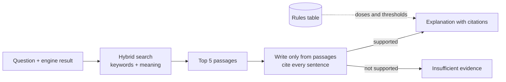

# RAG Build Guide (starts 1 October)

**For:** the RAG owner and Rhian · Your guide's order: causal inference first, RAG after the mid-sem.

## Status (26 September 2026): steps 1–4 built early, standalone

| Step | Status |
|---|---|
| Sources and licences | WHO 2018 (S01) + FDA S08, S19–S23 ingested; licences confirmed by the team; RSSDI-ESI 2020 (S02) still waits for its own PMC licence line |
| PDF → sections with pages; search index | Built (`pdf_text.py`, `ingest.py`, `retrieve.py`); 78 passages |
| Answers with citations; refuse when unsupported | Built (`explain.py`: template / Gemini / Ollama + citation checker) |
| Gold set + evaluation | Built (`eval/rag_gold.csv`, `python -m diacausal_rag.evaluate`); the doctor still has to review the 20 flagged questions |
| Connect to engine and UI | Website: Evidence tab explanation + "Evidence for this option" on each card. Chat app: not yet |

Results (`results/rag_eval_summary.csv`, template back-end) against the targets below: recall@5 0.933
(target ≥ 0.80, met); citation precision 1.000 (≥ 0.95, met); doses 0 (met); abstention accuracy
0.800 (target ≥ 0.95, **not met**: 2 of 10 out-of-scope questions — gestational-diabetes diet and
statins — still get passages). The coverage threshold was tuned on this same gold set, so these
numbers are optimistic; a held-out set written by the doctor is the honest next test. Faithfulness
for the Gemini back-end is measured once the key is set (`--backend gemini`).

## What RAG does in DiaCausal

After the engine shows the numbers, RAG explains them in words — but only using sentences found in approved guideline documents, and it shows exactly where each sentence came from: document, version, section and page. If nothing in the documents supports an answer, it says so. It never writes doses or thresholds; those come only from the rules table.

## What to say about RAG on 30 September

> "RAG is our next phase, from 1 to 16 October. We already have an early prototype, DiaCausal-RAG-Core, built on the open-source Kotaemon framework. The October version will search only licence-cleared guidelines and cite every sentence."

Show one screenshot of the prototype, clearly labelled "early prototype".

## Plan

| Dates | Step | Done when |
|---|---|---|
| 1–3 Oct | Choose sources and fill the licence table | Every document has a licence bucket |
| 4–6 Oct | Turn PDFs into sections with page numbers; build the search index | Top 5 passages come back for a question |
| 7–9 Oct | Answers with citations; refuse when unsupported | 10 test questions answered with citations |
| 10–13 Oct | 60-question gold set (the doctor reviews 20); evaluation | Recall@5, citation precision and abstention measured |
| 14–16 Oct | Connect to the engine output and the UI | The demo shows numbers plus a cited explanation |

If Claude Pro ends around 6 October, do steps 1–2 and as much of step 3 as possible before then.

## Step 1 — Sources and licences (before any code)

Our licence policy has five buckets:

1. Indian government and guideline sources — preferred.
2. Open international guidelines — check each licence.
3. Public terminologies.
4. NoDerivatives sources (StatPearls, Endotext, ICD-11) — quote word for word, with attribution only.
5. Never ingest: the National Formulary of India, Harrison's, Joslin's, the RSSDI Textbook, or the full ADA Standards of Care.

Candidates to check (you must verify each licence yourself): the ICMR Guidelines for Management of Type 2 Diabetes (2018); ICMR Standard Treatment Workflows; the National List of Essential Medicines 2022; WHO diabetes guidance; KDIGO 2022 (check its reuse terms); the IDF recommendations PDF already in our folder (check its terms); and the FDA labels on DailyMed for the three example drugs.

**Licence table template**

| Source | Version/year | Publisher | URL | Licence wording (quote it) | Bucket | OK to use? | Checked by / date |
|---|---|---|---|---|---|---|---|
| | | | | | | | |

## Step 2 — How the pipeline works



- **Parse:** PDF to text by section, keeping page numbers.
- **Chunk:** about 400 words per chunk, never crossing a section boundary.
- **Label:** every chunk carries source, version, section, page and licence bucket.
- **Search:** keyword search (BM25) plus meaning search (embeddings); keep the best 5.
- **Answer:** the language model may only use those 5 passages and must cite each sentence; otherwise it refuses.
- **Safety:** questions about doses or thresholds are answered from the rules table, never by the model.

## Step 3 — Build choices (honest comparison)

| Option | Good | Not so good | Recommendation |
|---|---|---|---|
| Keep extending DiaCausal-RAG-Core (Kotaemon) | Already exists; Apache-2.0 licence | Large framework; hard to enforce our citation and dose rules; harder to explain in the viva | Keep only as the early prototype |
| A lean pipeline inside our Python service (about 300 lines) | Small, testable, easy to explain; enforces our rules | Has to be written (1–2 Claude Code sessions) | Recommended |

**Language model options:** the Claude API (billed separately from the Pro plan), Google's Gemini API (you have Google AI Pro — check the API's free tier), or a small local model on the MacBook with Ollama (free, slower). Only synthetic or public text goes to any model — never patient data.

## Step 4 — Claude Code prompts (use from 1 October)

**R1 — Licence table**

```text
Create docs/SOURCES.md from this candidate list: [paste the list]. For each source find the official URL, version or year, publisher, and the exact licence wording; assign a bucket from our licence policy in docs/03_RAG_Build_Guide.md; mark anything uncertain UNVERIFIED. Do not download anything in the "never ingest" bucket.
```

**R2 — Ingestion**

```text
Build rag/ingest.py: parse the PDFs in rag/sources/ into sections with page numbers, split them into chunks of about 400 words without crossing sections, label each chunk with source, version, section, page and licence bucket, and save the index to rag/index/. Add tests.
```

**R3 — Retrieval**

```text
Build rag/retrieve.py: hybrid BM25 plus embedding search that returns the top 5 chunks with scores. Add a test with 10 questions and the section each should find.
```

**R4 — Answers with citations**

```text
Build rag/answer.py: given a question and the top chunks, write an answer that uses only those chunks, with a citation after every sentence (source, version, section, page). If the chunks don't support an answer, return "insufficient evidence in approved sources". Never output a dose or threshold; send those questions to data/rules.csv instead. Add tests for refusing and for "no dose text".
```

**R5 — Evaluation**

```text
Build rag/eval.py over our gold question set: Recall@5, citation precision, faithfulness (manual labels, or RAGAS if it installs cleanly), and abstention accuracy on out-of-scope questions. Save results to results/rag/.
```

**R6 — Connect to the demo**

```text
Add an "Evidence" panel to the demo: for the patient's result, show a short explanation from rag/answer.py with its citations, and "insufficient evidence" when nothing supports it.
```

## RAG targets (team-set)

| Metric | What it means | Target |
|---|---|---|
| Recall@5 | The right passage is in the top 5 | ≥ 0.80 |
| Citation precision | Each citation really supports its sentence | ≥ 0.95 |
| Faithfulness | Claims in the answer are supported by the passages | ≥ 0.90 |
| Abstention accuracy | Out-of-scope questions are correctly refused | ≥ 0.95 |
| Free-text doses | Doses written by the model | 0 |
