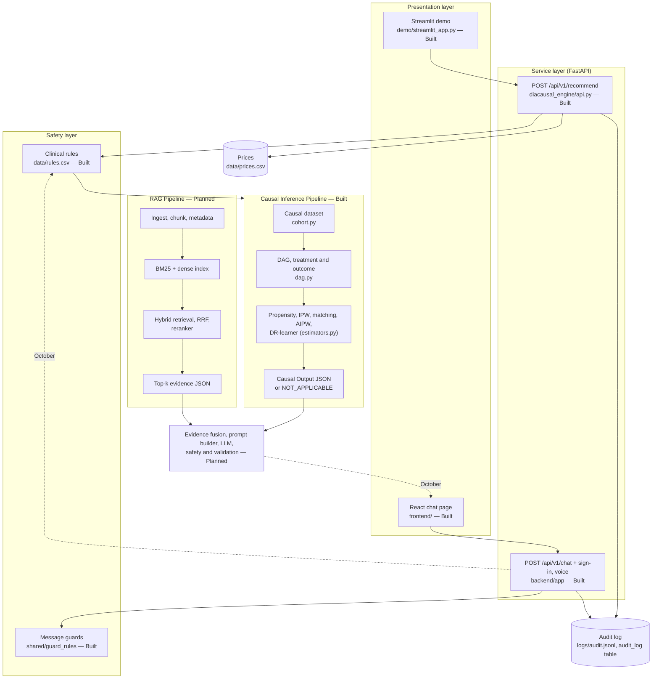
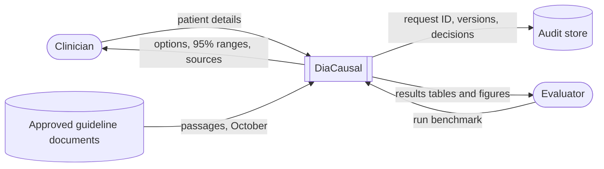
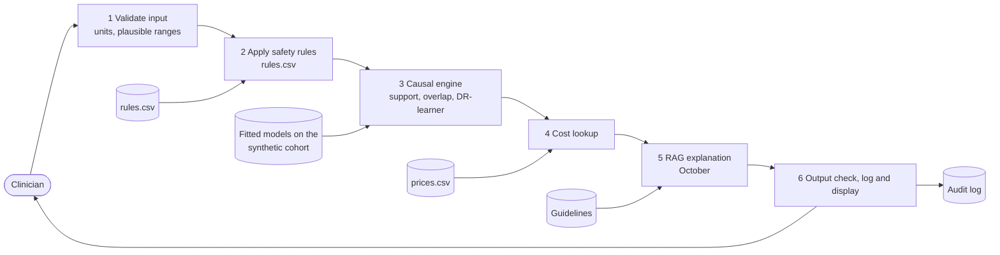
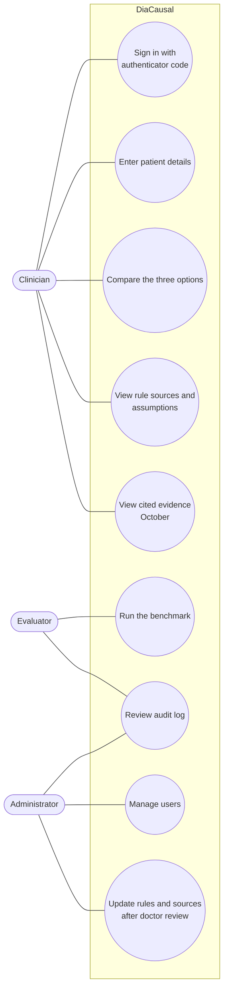
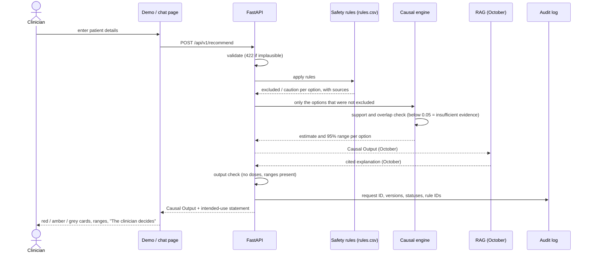
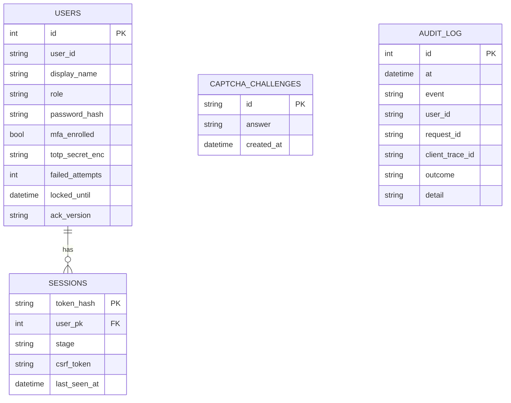

# System Design: DiaCausal

> Research prototype for clinician evaluation; not a marketed medical device; not for unsupervised clinical use.

**For:** mentor item 4 ("System Design"), slides 10–13 and report Chapter 4. The diagrams follow
the team's flow chart, which has two pipelines running side by side: RAG and Causal Inference.
They meet in an Evidence Fusion layer. Diagrams are Mermaid: GitHub draws them automatically,
and <https://mermaid.live> exports them as PNG for the slides.

Legend: **Built** = in the repo and tested today. **Planned** = October.

## 1. Architecture (layered block diagram)



**Plain English:** the clinician uses a screen. The screen calls our API. The safety rules run
first, then the causal engine produces a structured result. In October the RAG pipeline adds cited
evidence, and the fusion layer turns both into a checked explanation. Every request is logged.

## 2. Data flow diagrams

### Level 0 (context)



### Level 1



## 3. Use-case diagram



## 4. Sequence diagram: one consultation



## 5. Module design (the causal engine)

| Module | Responsibility | Main functions | Status |
|---|---|---|---|
| `config.py` | Load `params.yaml`; refuse unsourced numbers | `load_params`, `Params.get` | Built |
| `cohort.py` | Synthetic dataset; CSV ingestion | `generate_cohort`, `observed_view`, `load_dataset`, `true_population_effects` | Built |
| `dag.py` | Causal diagram and adjustment set | `load_dag`, `Dag.adjustment_set` | Built |
| `guardrails.py` | Safety rules from `rules.csv` | `load_rules`, `RuleTable.apply` | Built |
| `propensity.py` | Cross-fitted propensity, overlap and support checks | `crossfit_propensity`, `overlap_check`, `support_check` | Built |
| `estimators.py` | Naive, IPW, matching, AIPW; DR, T and S learners | `naive`, `ipw`, `matching`, `aipw`, `DRLearner` | Built |
| `metrics.py` | Bias, RMSE, coverage, PEHE, regret, SMD | `bias`, `pehe`, `policy_regret`, `balance_table` | Built |
| `refute.py` | Placebo, random common cause, subset, E-value | `refute`, `e_value` | Built |
| `benchmark.py`, `figures.py` | 20-repeat benchmark, tables and figures | `run`, `main` | Built |
| `recommend.py`, `schemas.py` | One patient → Causal Output; output check; audit | `Engine.recommend`, `check_output`, `CausalOutput` | Built |
| `api.py` | REST API | `POST /api/v1/recommend`, `GET /api/v1/health` | Built |
| `demo/streamlit_app.py` | Demo screen | — | Built |
| `diacausal_rag/` | Ingest, retrieve, evidence JSON | skeleton only | Planned |

**Implementation status for the "25%" slide:**

| Component | Status |
|---|---|
| Causal engine | Built: all 10 steps a–j plus refutation, 149 tests |
| Chat app | Built: sign-in, guards, patient panel, clinical rules, voice, deployment |
| RAG, fusion and LLM | Planned; see the RAG plan |

## 6. Data design

### `data/rules.csv` (safety rules; the only place the engine's thresholds live)

| Column | Meaning | Example (R01) |
|---|---|---|
| rule_id | Identifier | R01 |
| arm | Drug class | SGLT2i |
| representative_molecule | Example drug | dapagliflozin |
| field, op, value | Condition | egfr, lt, 45 |
| action | EXCLUDE or CAUTION | EXCLUDE |
| message | Text shown to the clinician | "Not recommended to improve glycaemic control when eGFR < 45 …" |
| source, section | Citation | FARXIGA US prescribing information; KDIGO 2022 — Sec 1, 2.2 |
| status | VERIFIED or UNVERIFIED | VERIFIED |

### `data/params.yaml` (every generator and engine number)

Each entry has the form `{value, unit, source, status (CITED | ASSUMED-DIRECTIONAL | TEAM-SET), note}`.
The sections are `sources`, `arms`, `dag`, `generator` (inclusion, covariates, assignment, outcome),
`engine` (folds, overlap 0.05, clipping, refutation settings), `display` (Asian-Indian BMI cut-offs,
input ranges) and `context`.

### `data/prices.csv`

The columns are `arm, representative_molecule, inr_per_month, as_of_date, source, status`. A price
is shown only when its status is CONFIRMED and it has a date and a source.

### Causal Output (JSON returned by the API)

```json
{
  "request_id": "adb2e55233da",
  "applicable": "APPLICABLE",
  "intervention": "Add one of three options to metformin: SGLT2 inhibitor, DPP-4 inhibitor or sulfonylurea",
  "outcome": {"name": "Change in HbA1c at 6 months", "unit": "percentage points of HbA1c (%)"},
  "options": [
    {"arm": "SGLT2i", "status": "excluded", "safety": [{"rule_id": "R01", "action": "EXCLUDE", "source": "..."}], "effect": null},
    {"arm": "DPP4i", "status": "estimate", "effect": {"value": -0.68, "ci_low": -1.09, "ci_high": -0.27, "level": 0.95},
     "confidence": {"propensity": 0.54, "overlap_threshold": 0.05}, "cost": {"label": "price unavailable"}}
  ],
  "comparisons": [{"first": "SU", "second": "DPP4i", "difference": {"value": -0.14, "ci_low": -0.71, "ci_high": 0.43}}],
  "assumptions": ["Synthetic data only ...", "No unmeasured confounding ..."],
  "versions": {"engine": "0.3.0", "params_sha": "...", "rules_sha": "..."},
  "decision": "Decision support only. The clinician decides.",
  "intended_use": "Research prototype for clinician evaluation; not a marketed medical device; not for unsupervised clinical use."
}
```

*Shortened. The full example is in the demo's "Structured Causal Output" box, and the schema is in
`diacausal_engine/schemas.py`.*

### Audit line (`logs/audit.jsonl`; never patient values)

`time, request_id, engine, params_sha, rules_sha, fields_received, applicable, options{arm: {status, rules}}`

### Chat app database (SQLite via SQLAlchemy + Alembic; `backend/app/db/models.py`)



## 7. API design

| Method and path | Service | Input | Output | Access |
|---|---|---|---|---|
| `POST /api/v1/recommend` | causal engine (port 8001) | `{"schema_version":"1.0","patient":{age, sex, duration_years, hba1c, egfr, bmi, flags…}}` | Causal Output; 422 with a plain-English message | open (local demo) |
| `GET /api/v1/health` | causal engine | — | `{status, engine, intended_use}` | open |
| `POST /api/v1/chat` | chat app (port 8000) | `{"schema_version":"1.0","client_trace_id":"…","parts":[text, patient]}` | six stage results, options part, intended use | signed-in clinician |
| `POST /api/v1/transcribe` | chat app | audio (never stored) | text | signed-in clinician |
| `/api/v1/auth/*` | chat app | CAPTCHA, password, TOTP | session cookie + CSRF token | public, then CSRF |

## 8. Design decisions (and why)

| Decision | Why |
|---|---|
| Safety rules before estimation | An unsafe option must never get a number, so it can never be ranked or shown as attractive |
| Thresholds only in cited tables | Auditable by a doctor; a test scans the code for hard-coded numbers |
| Doubly robust estimation (AIPW, DR-learner) | Correct if either the propensity model or the outcome model is correct; valid 95% intervals |
| Abstain below 0.05 propensity | Refusing is safer than extrapolating to patients the data never covered |
| Synthetic data with known truth | The only way to *measure* bias and coverage; real data never reveals the truth |
| Structured Causal Output | The fusion layer and LLM (October) can use the numbers without re-deriving them, and can only paraphrase checked values |
| Streamlit demo + FastAPI | A one-command demo for the presentation; a clean API a hospital system could call later |
