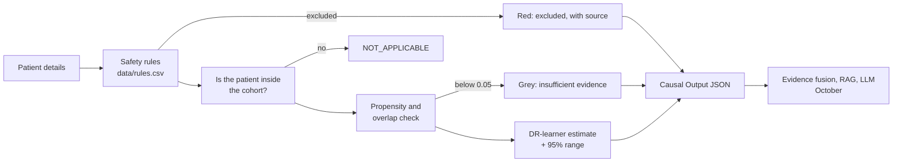

# 07 — The causal engine, explained simply

> Research prototype for clinician evaluation; not a marketed medical device; not for unsupervised clinical use.

**For:** everyone in Group 28. Read it once before the viva. Every part gives:
- **A**: an everyday analogy;
- **N**: a tiny numeric example you can check by hand;
- **Viva**: the one sentence to say;
- **Code**: where it lives.

Numbers marked *illustrative* were made up to teach the idea. All other numbers come from `results/`,
the committed benchmark: 20 synthetic cohorts × 5,000 patients (`results/run_info.json`). They are
**synthetic data** results; say so whenever you quote them.

## The whole thing in five lines

For one adult with type 2 diabetes already on metformin, DiaCausal does four things:
1. It **removes unsafe options** using cited rules (`data/rules.csv`).
2. It checks whether enough similar patients got each remaining option.
3. It **estimates each option's 6-month HbA1c change with a 95% range**, or says "insufficient evidence".
4. It returns everything as a structured **Causal Output** for the rest of the system.

The options are an SGLT2 inhibitor, a DPP-4 inhibitor and a sulfonylurea. The clinician decides.

---

## 1. Prediction vs causation
- **A:** A weather forecast *predicts* rain. Deciding whether to carry an umbrella is a *what-if* question.
- **N:** Patients on SGLT2i had HbA1c fall by 1.05 on average (*illustrative*). That doesn't mean SGLT2i would make *this* patient's HbA1c fall by 1.05.
- **Viva:** "Ordinary machine learning predicts what will happen; we need what would happen under each drug for the same patient, which is a causal question."

## 2. Confounding by indication
- **A:** Hospitals look deadly because the sickest people go there.
- **N (build guide worked example):**

  | Group | Got SGLT2i | Got sulfonylurea | Difference |
  |---|---|---|---|
  | High starting HbA1c | 300 patients, −1.2 | 100 patients, −1.0 | −0.2 |
  | Lower starting HbA1c | 100 patients, −0.6 | 300 patients, −0.5 | −0.1 |
  | Pooled (naive) | −1.05 | −0.625 | **−0.425** |

  Like with like: 0.5 × (−0.2) + 0.5 × (−0.1) = **−0.15**. The naive answer is about 3× too big.
- **Viva:** "Doctors give certain drugs to certain patients, so a plain comparison mixes the drug's effect with who received it."

## 3. Potential outcomes (counterfactuals)
- **A:** A choose-your-own-adventure book. You read only one ending, but the others exist.
- **N:** One patient's three possible 6-month changes might be SGLT2i −0.9, DPP-4i −0.7, SU −1.0 (*illustrative*). Real data shows only the drug they got.
- **Viva:** "Each patient has one outcome per drug; we observe only one, so causal inference estimates the missing ones."
- **Code:** `diacausal_engine/cohort.py` stores all three as `y_true_<arm>`, hidden from the estimators.

## 4. The synthetic cohort, and why we use it
- **A:** A driving simulator. You can crash on purpose because you know what the right move was.
- **N:** In our cohort the true SGLT2i-minus-DPP-4i effect is **−0.21**. The naive comparison says **−0.37** on average, so we can *prove* it's wrong.
- **Viva:** "No open Indian dataset records the second-line drug and 6-month HbA1c, so we test on an India-calibrated synthetic cohort where the true answers are known."
- **Why not the Pima dataset:** it comes from Akimel O'odham women in Arizona, not India, and it has no treatment column.
- **Code:** `cohort.py`, `data/params.yaml`.

## 5. The params.yaml statuses
- **A:** A recipe that marks each ingredient as "from Grandma's book", "roughly like Grandma's", or "our twist".
- **N:**

  | Value | Status | Source |
  |---|---|---|
  | Obesity cut-off 25 | CITED | Misra 2009 |
  | SGLT2i effect −0.75 | ASSUMED-DIRECTIONAL | Tsapas 2020 (direction and size); the exact number is ours |
  | Average age 55 | TEAM-SET | our choice |

- **Viva:** "Every number has a source and an honesty label, and the program refuses to run if one is missing."

## 6. The DAG: confounders and mediators
- **A:** A family tree of causes, drawn *before* looking at the data.
- **N:**
  - HbA1c → drug choice and HbA1c → outcome, so HbA1c is a **confounder**: adjust for it.
  - SGLT2i → weight loss → HbA1c, so weight change is a **mediator**: never adjust for it, or you hide part of the drug's real effect.
- **Viva:** "The causal diagram tells us which variables to adjust for; mediators like weight change are excluded."
- **Code:** `diacausal_engine/dag.py` and the `dag:` section of `data/params.yaml`.

## 7. Safety rules (guardrails)
- **A:** A lifeguard who checks the pool before anyone starts swimming.
- **N:** At eGFR 40, rule R01 (eGFR below 45) **excludes SGLT2i**. It shows red with its FDA-label source, and the engine never computes a number for it.
- **Viva:** "Cited safety rules run before any estimate; thresholds live only in rules.csv, never in code, and no doses are ever shown."
- **Code:** `diacausal_engine/guardrails.py`, `data/rules.csv`.

## 8. The propensity score
- **A:** Guessing which dish a regular customer will order, from their habits.
- **N:** For the typical demo patient: P(SGLT2i) = 0.43, P(DPP-4i) = 0.25, P(SU) = 0.32. The three always sum to 1.
- **Viva:** "The propensity score is the probability that a patient like this receives each drug, estimated with multinomial logistic regression."
- **Code:** `diacausal_engine/propensity.py`.

## 9. Cross-fitting
- **A:** You never mark your own exam. A classmate who didn't see your answers marks it.
- **N:** Split 5,000 patients into 5 groups of 1,000. Train on 4,000 and score the remaining 1,000. Rotate so every group is scored once.
- **Viva:** "Each patient is scored by a model that never saw them, which stops overfitting from making results look better than they are."

## 10. Overlap and the 0.05 rule
- **A:** You can't review a restaurant that nobody like you has ever visited.
- **N:** The older patient preset has P(SU) = **0.006**. That is below 0.05, so the demo shows grey **"insufficient evidence"** instead of a number.
- **Viva:** "If fewer than about 5% of similar patients got a drug, a fair comparison is impossible, so we refuse to guess."

## 11. The naive estimate
- **A:** Judging a coaching class only by its toppers, without asking who joined.
- **N:** Average bias over 20 cohorts is **−0.16** for SGLT2i vs DPP-4i. Its 95% intervals contained the truth **0%** of the time.
- **Viva:** "The naive difference ignores who got which drug, so it's biased."
- **Code:** `diacausal_engine/estimators.py` (`naive`).

## 12. IPW (inverse probability weighting)
- **A:** In a survey where few village people answered, you give each village answer more weight.
- **N (viva sheet):** Two patients with outcomes −1.0 and −0.4 and propensities 0.8 and 0.2.
  - Their weights are 1/0.8 = 1.25 and 1/0.2 = 5.
  - Weighted mean: (1.25 × −1.0 + 5 × −0.4) ÷ 6.25 = **−0.52**, against a naive −0.70.
- **Result:** bias **+0.001**, coverage **100%** (SGLT2i vs DPP-4i).
- **Viva:** "IPW up-weights patients who got an unusual drug for their type, so each group looks like the whole population."

## 13. Propensity-score matching
- **A:** Pairing up twins to compare them.
- **N:** Patient A got SGLT2i (−0.9). The DPP-4i patient with the closest propensities scored −0.7. So A's "missing" DPP-4i outcome is filled in as −0.7, and the difference is −0.2 (*illustrative*).
- **Result:** bias **−0.002**, coverage **95%**.
- **Viva:** "Matching compares each patient with the most similar patient who got the other drug."

## 14. AIPW (doubly robust; the DML score)
- **A:** Two independent smoke alarms. If either one works, you're safe.
- **N:** The outcome model guesses −0.8. The patient really got SGLT2i and scored −1.0, with propensity 0.5.
  - Score = −0.8 + (−1.0 − (−0.8)) ÷ 0.5 = **−1.2**.
  - That is the model's guess, corrected by what really happened.
- **Result:** bias **+0.002**, RMSE **0.023**, coverage **95%** (SGLT2i vs DPP-4i).
- **Viva:** "AIPW combines an outcome model with propensity weights; it is right if either one is right, and it gives valid confidence intervals."

## 15. The 95% confidence interval
- **A:** A forecast of "25–29 °C" instead of "27 °C".
- **N:** Estimate −0.20 with standard error 0.03 gives −0.20 ± 1.96 × 0.03 = **−0.26 to −0.14** (*illustrative*).
- **Viva:** "Every number comes with a 95% range, never a bare point estimate."

## 16. CATE and the DR-learner (this patient's own effect)
- **A:** The average shoe size tells you nothing about *your* size. The DR-learner measures your foot.
- **N:** Suppose the fitted formula is −0.9 − 0.2 × (HbA1c − 8.5) (*illustrative*). Then a patient with HbA1c 9.5 gets −1.1, with their own 95% range.
- **Result:** the per-patient 95% ranges contained the true effect for **93–95%** of test patients.
- **Viva:** "The DR-learner regresses the AIPW scores on patient details to give a personalised effect with an interval, keeping the double robustness."
- **Code:** `estimators.DRLearner`.

## 17. T-learner and S-learner (simpler comparisons)
- **A:** The T-learner uses two fortune tellers, one per drug. The S-learner uses one teller who is told which drug.
- **N:** The SGLT2i model says −0.9 and the DPP-4i model says −0.7, so the effect is −0.2 (*illustrative*).
- **Result:** per-patient error (PEHE):
  - DR-learner 0.10–0.12;
  - S-learner 0.10–0.11 (similar to the DR-learner);
  - T-learner 0.18–0.19 (about double);
  - naive 0.17–0.21.
- **Viva:** "We compared against simpler learners; the DR-learner halves the T-learner's error and also gives intervals."

## 18. The metrics (how we grade it)

| Metric | Plain meaning | Tiny example | Our result (synthetic) |
|---|---|---|---|
| **Bias** | average miss | 5 runs averaging −0.21 when the truth is −0.21 → 0 | AIPW +0.002; naive −0.16 |
| **RMSE** | typical miss | errors −0.01, 0.01, 0.02, −0.02, 0 → √(0.001/5) = 0.014 | AIPW 0.02–0.03 |
| **Coverage** | how often the 95% range contains the truth | 19 of 20 → 95% | AIPW 90–95% |
| **PEHE** | per-patient error | true −0.3, −0.2, −0.1 vs estimated −0.4, −0.2, 0.0 → √(0.02/3) = 0.08 | DR-learner 0.10–0.12 |
| **Policy regret** | how much worse the pick is than the true best | picked −0.9 when −1.0 was possible → 0.1 | DR-learner 0.011; naive 0.062 |
| **Abstention** | share of answers that are "insufficient evidence" or excluded | 1 of 12 pairs → 8% | 2.5% |
| **SMD (balance)** | how different two groups look | HbA1c 8.9 vs 8.4 with SD 1.0 → 0.5; below 0.1 is balanced | 0.70 before → 0.08 after weighting |

- **Viva:** "Because the truth is known, we measured bias, RMSE, coverage, per-patient error, regret and balance directly."
- **Code:** `diacausal_engine/metrics.py`.

## 19. The benchmark
- **A:** Taking a mock exam 20 times, not once.
- **N:** 20 cohorts × 5,000 patients, about 2.5 minutes.
- **Viva:** "We repeated the whole experiment 20 times so the results aren't luck."
- **Command:** `python -m diacausal_engine.benchmark`. Output goes to `results/`.

## 20. Refutation tests: trying to break our own answer
- **A:** A lock tester who tries every trick; if the lock resists, you trust it more.
- **The three tricks and the E-value:**
  - **Placebo treatment:** shuffle who got which drug. The "effect" should vanish.
    - The average placebo effect was **0.003–0.007**, essentially 0.
    - 90–100% of the 20 placebo ranges contained 0.
  - **Random common cause:** add a column of pure noise as a fake confounder. The answer should not move.
    - For SGLT2i vs DPP-4i: −0.156 became −0.155.
  - **Data subset:** re-run on a random 80% of patients. The answer should stay about the same (−0.153).
  - **E-value:** how strong would a *hidden* confounder have to be to explain the effect away?
    - For SGLT2i vs DPP-4i the E-value is **1.72**, and **1.54** for the bound of the range nearest zero.
    - So a hidden factor would need to be associated with both drug choice and outcome by a risk ratio of about 1.5–1.7.
- **Result:** **9 of 9** checks passed (`results/refutation.csv`, `results/evalues.csv`).
- **Viva:** "We ran placebo, random-common-cause and subset refutations, all passed, and the E-value tells us how strong unmeasured confounding would need to be."
- **Why the placebo shuffle is repeated 20 times:** one shuffle is *expected* to fail 5% of the time just by chance (that is what a 95% range means), so we check that at least 85% of 20 placebo ranges contain 0.

## 21. The Causal Output, including NOT_APPLICABLE
- **A:** A standard lab-report format that the next department knows how to read.
- **N:** A type 1 diabetes patient gets **NOT_APPLICABLE**, with the reason "the cohort contains only type 2 diabetes".
- **Viva:** "The engine returns structured JSON — applicable, intervention, outcome, effect, confidence, assumptions — which our flow chart's evidence-fusion layer will use."
- **Code:** `diacausal_engine/schemas.py`, `recommend.py`.

## 22. The demo, the API and the audit log
- **A:** The shop window (demo), the service counter (API) and the CCTV record (audit log).
- **N:** An audit line records `"SGLT2i": {"status": "excluded", "rules": ["R01"]}`. It never contains the patient's age, eGFR or HbA1c.
- **Viva:** "Every request is logged with IDs, versions and decisions — never patient values."
- **Commands:**
  - demo: `streamlit run demo/streamlit_app.py`
  - API: `uvicorn diacausal_engine.api:app --port 8001`, then `POST /api/v1/recommend`

## 23. Limitations (say these confidently; examiners like honesty)
1. **Synthetic data only.** It shows that the *method* works, not real-world drug effects.
2. **Assumed effect sizes.** They follow trials in direction and rough size; the exact values are ours.
3. **No hidden confounders assumed.** The E-value says how strong one would need to be.
4. **US-label rules.** The safety rules come from US labels and await review by the doctor for Indian practice.
5. **Unconfirmed prices.** They show "price unavailable" until confirmed.
6. **Weaker for rare patients.** Estimates are weaker for rare patient types (past DKA or pancreatitis, about 1–2% of the cohort).

---

## For teammates: "What is it, and is it hosted?"

**What kind of causal engine is it?** A *doubly robust* causal-inference engine for three treatment
options. It uses:
- a cross-fitted multinomial propensity model;
- IPW, propensity-score matching and AIPW for average effects;
- a DR-learner for each patient's own effect;
- refutation tests and E-values to check itself.

It is written in Python (NumPy, scikit-learn), with a Streamlit demo and a FastAPI endpoint.

**What does it do?** For one patient it removes unsafe drugs using cited rules, then estimates each
remaining drug's 6-month HbA1c change with a 95% range, or says "insufficient evidence".

**What is it for?** Helping a doctor compare the options *fairly*. Old records are biased because
different patients get different drugs. The doctor always decides.

**How does it do it?**
1. It learns from 5,000 synthetic, India-calibrated patients where the true answers are known.
2. It corrects the bias with propensity weighting and doubly robust estimation.
3. It was tested 20 times against the truth and passed 9 of 9 refutation checks.

**Is it hosted?**
- **The code** is on GitHub `main`.
- **Running it** on a laptop is two commands (see the README).
- **Online:** the demo can be put on Streamlit Community Cloud as a free backup link. The steps
  are in the README section "Put the demo online (free)".

**Where should my code go?** Please don't upload a second causal engine onto `main`. Pull `main`,
and put any code of your own on a separate branch, so we can compare the two first (see
[`docs/INTEGRATING_A_TEAMMATE_ENGINE.md`](../INTEGRATING_A_TEAMMATE_ENGINE.md)).
